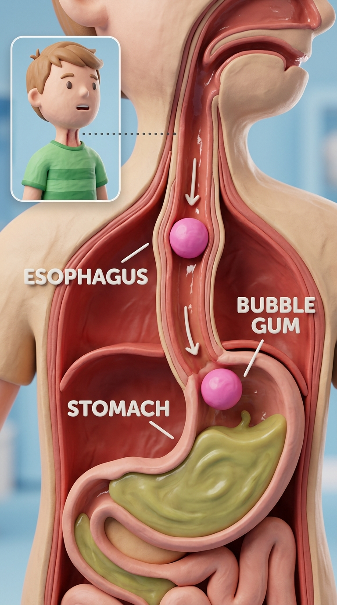

<p align="right"><b>English</b> · <a href="README.zh.md">简体中文</a></p>

# 🎬 Zack D Director

**Turn any topic into a finished Zack D Films-style 3D animated short video — curiosity-loop script, character consistency sheets, 3D keyframe renders, Veo 3.1 motion clips, cloned voiceover, zoom-ins & screen shakes, all automated.**

An **agent skill** that runs end to end on the **MuAPI platform** (`api.muapi.ai`) + local `ffmpeg`, usable by any coding agent (Claude Code, Codex, Antigravity, Cursor, etc.). You give it a one-line question; it gives you a viral `mp4` short.

  

---

## 📽️ Generated Showcase 3D Videos (Powered by MuAPI Veo 3.1)

Below are actual 3D video clips and keyframes generated end-to-end using **Zack D Director** on **MuAPI**:

<div align="center">



<b>▶ 3D Keyframe & Cutaway Model — "What Happens When You Swallow Gum?"</b>

</div>

### 🎬 Generated Clips & Local Assets

| Shot ID | Scene / Action | Camera Movement | Generated Video Clip | Keyframe Poster | Motion Engine |
|---|---|---|---|---|---|
| **`beat_1_a`** | **Boy Swallowing Pink Gum** | `push_in` | [`out/test_run/clips/beat_1_a.mp4`](out/test_run/clips/beat_1_a.mp4) | [`out/test_run/keyframes/beat_1_a.png`](out/test_run/keyframes/beat_1_a.png) | `veo3.1-fast-image-to-video` |
| **`beat_1_b`** | **Esophagus & Stomach Cutaway** | `tilt_down` | [`out/test_run/clips/beat_1_b.mp4`](out/test_run/clips/beat_1_b.mp4) | [`out/test_run/keyframes/beat_1_b.png`](out/test_run/keyframes/beat_1_b.png) | `veo3.1-fast-image-to-video` |
| **`beat_2_a`** | **Microscopic Stomach Acid Churn** | `pan_right` | [`out/test_run/clips/beat_2_a.mp4`](out/test_run/clips/beat_2_a.mp4) | [`out/test_run/keyframes/beat_2_a.png`](out/test_run/keyframes/beat_2_a.png) | `veo3.1-fast-image-to-video` |
| **`beat_2_b`** | **Intestinal Muscle Contraction** | `static` | [`out/test_run/clips/beat_2_b.mp4`](out/test_run/clips/beat_2_b.mp4) | [`out/test_run/keyframes/beat_2_b.png`](out/test_run/keyframes/beat_2_b.png) | `veo3.1-fast-image-to-video` |
| **`beat_3_a`** | **Boy Smiling in Relief** | `pull_out` | [`out/test_run/clips/beat_3_a.mp4`](out/test_run/clips/beat_3_a.mp4) | [`out/test_run/keyframes/beat_3_a.png`](out/test_run/keyframes/beat_3_a.png) | `veo3.1-fast-image-to-video` |

---

## 🔑 MuAPI Configuration

Set your **MuAPI** API Key (get one at [muapi.ai](https://muapi.ai)):
```bash
export MUAPI_API_KEY="sk-..."
```

---

## 🎬 What It Is

The look is the iconic **Zack D Films 3D animated short** style: 
- Stylized 3D digital characters and anatomical models.
- High-contrast dramatic studio lighting with subsurface scattering and subsurface gloss.
- Internal cross-sections showing biological, mechanical, or physical processes in action.
- Curiosity-loop scripts where every single line opens a question your brain physically needs closed.
- High-energy editing: camera push-ins on key impact beats, screen shakes on cuts, fast narration, and punchy captions.

---

## 🔄 How It Works

One question or topic flows through a single `beats.json` file per project:

```
topic / question
  │
  ├─ 1. trend research     find curiosity-driven questions with high viral retention
  ├─ 2. script breakdown   write curiosity loops into beats.json   ◀── GATE 1: you approve the script
  ├─ 3. character sheets   generate orthographic 3D turnarounds    (character & asset consistency)
  ├─ 4. 3D keyframes       render detailed 3D scene keyframes      (nano-banana-2 / flux-dev)
  ├─ 5. motion clips       animate each 3D keyframe                (veo3.1-fast-image-to-video)
  ├─ 6. cloned voice       narrate in your cloned voice            (minimax-speech-2.6-turbo)
  ├─ 7. assemble           ffmpeg: zoom-ins, screen shakes, music ducking & captions
  └─ final.mp4
```

---

## 🛠️ Requirements

- A **coding agent** — Claude Code, Codex, Antigravity, Cursor, etc.
- **MuAPI Key** (`MUAPI_API_KEY`)
- **ffmpeg** + **ffprobe** (`brew install ffmpeg` / `choco install ffmpeg`)
- **Python 3** with **Pillow** (`pip install pillow`)
- ~60s recording of your own voice for voice cloning

---

## 🚀 Quick Start

Ask your coding agent with the skill installed:

> *"Make me a Zack D Films style short explaining what happens when you swallow gum."*

The agent will draft a curiosity script for your approval, generate character reference sheets, render 3D keyframes, animate motion with Veo 3.1, clone your voice, and assemble `out/<project>/final.mp4` with zoom-ins and screen shakes!

---

## 📁 Repository Structure

```
SKILL.md              the primary skill instructions for coding agents
SKILL.zh.md           the skill instructions in Chinese
AGENTS.md             entry point for non-Claude agents (Codex, etc.)
references/           creative & engine documentation
  prompt-guide.md       3D visual style rules, lighting, shaders & macro cross-sections
  beat-layer.md         curiosity-loop script formulas & pacing rules
  character-sheets.md   multi-angle orthographic consistency system
  voices.md             voice cloning guidelines & TTS configuration
  models-and-gotchas.md MuAPI endpoints, ffmpeg FX, screen shake & zoompan recipes
scripts/              pipeline python automation scripts
  provider.py         MuAPI client (veo3.1, nano-banana-2, minimax-speech)
  trend_research.py   curiosity topic research tool
  script_generator.py generates beats.json breakdown
  character_sheets.py generates 3D turnaround reference sheets
  keyframes.py        renders 3D scene keyframes
  clips.py            animates 3D keyframes with Veo 3.1
  audio.py            synthesizes voice narration & BGM
  assemble.py         stitching, zoom-ins, screen shakes, captions
examples/             ready-to-run beats.json examples
```

---

## 📜 License

[MIT](LICENSE) © 2026 Zack D Director
